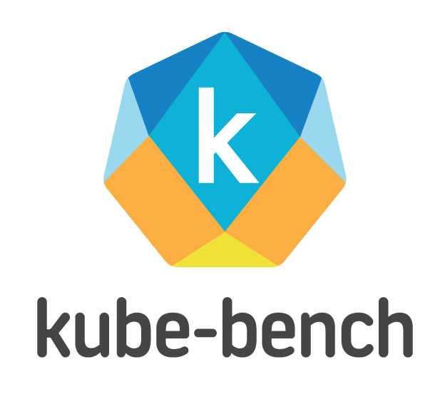

       

# Goal & Deliverables

MicroK8s analysed for CIS benchmark with kube-bench. 

This repository implements a 100% automated workflow ([microk8s-kube-bench.yml](.github/workflows/microk8s-kube-bench.yml) + [microk8s-kube-bench.sh](sh/microk8s-kube-bench.sh)) providing the installation of Microk8s on Ubuntu (run as a Github CI /CD worker). Kube-bench is then deployed and executed to obtain the analysis of the configuration of this Kubernetes cluster.

Last execution report on Github CI/CD is appended below.

All suggestions for improvements or extensions are welcome. Same for pull requests!

## MicroK8s

[Microk8s](https://github.com/ubuntu/microk8s) by Canonical is single-package, fully conformant and lightweight Kubernetes distribution that works on numerous flavours of Linux. It is aimed at developer workstations, IoT, Edge & CI/CD. Simple to manage, this pure upstream distribution has same-day tracking for new releases, patches generated by root project. The [package manager Snap](https://en.wikipedia.org/wiki/Snap_(package_manager)) takes care of corresponding automated updates when new upstream code gets pushed.

Canonical additionally provides various preconfigured [standard K8s add-ons](https://microk8s.io/docs/addons) on top of the raw distribution: dashboard, istio, knative, metallb, cilium, kubeflow, etc.  They make MicroK8s quite suitable for advanced tests on a laptop. It is also a very easy way to [get started](https://microk8s.io/tutorials) with K8s on an autonomous / personal system.

 
## Kube-bench

[kube-bench](https://github.com/aquasecurity/kube-bench) by [Aqua Security](https://www.aquasec.com/) is a Go application that analyses how securely 
Kubernetes is deployed securely by running the checks documented in the [CIS Kubernetes Benchmark](https://www.cisecurity.org/benchmark/kubernetes/).
Tests are configured with YAML files, making this tool easy to update as test specifications evolve.

The numbered items (like 1.2.3) found in execution report below correspond to the various points being defined and commented with this same number 
in the [official documentation](https://www.cisecurity.org/benchmark/kubernetes/) of the benchmark.

[This article](https://medium.com/better-programming/how-to-harden-your-kubernetes-cluster-with-kube-bench-fae71eb24d8) delivers deep and interesting 
insights on the benchmark.

## Fork and setup

If you want to reuse this repository, just fork it in your account. You can right away run this workflow by using the button defined in the workflow yaml via *'workflow_dispatch' directive.

## Last execution report

